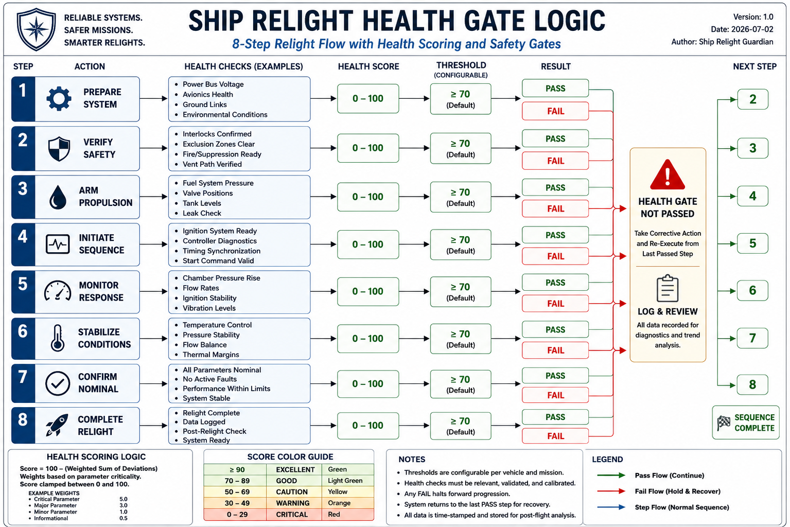

# Ship Relight Guardian

## Overview

Ship Relight Guardian is a modular Python simulation that demonstrates an autonomous engine relight decision pipeline inspired by reusable launch vehicle operations.

The system detects an engine failure, isolates the failed engine, evaluates vehicle and propellant health, scores the remaining engines, selects the healthiest candidate, determines whether a relight is safe, monitors the relight, and computes updated guidance for continued flight.

---

## Workflow

1. Detect engine-out
2. Isolate failed engine
3. Evaluate vehicle state
4. Evaluate propellant state
5. Score remaining engines
6. Select healthiest engine
7. Run relight permission gate
8. Monitor post-ignition stability
9. Compute reduced-engine guidance trim

---

## Project Structure

```
ship-relight-guardian/
│
├── src/
│   └── ship_relight_guardian/
│       ├── common/
│       ├── decision/
│       ├── detection/
│       ├── guidance/
│       ├── isolation/
│       ├── monitoring/
│       ├── propellant/
│       ├── scoring/
│       └── vehicle/
│
├── main.py
├── requirements.txt
├── README.md
└── LICENSE
```

---

## Current Status

- Engine-out detection ✔
- Engine isolation ✔
- Vehicle health evaluation ✔
- Propellant evaluation ✔
- Engine health scoring ✔
- Engine selection ✔
- Relight permission gate ✔
- Post-ignition monitoring ✔
- Reduced-engine guidance ✔

---

Add system diagram to README
---

## System Diagram


## Author

Christopher Layhew Sr.
